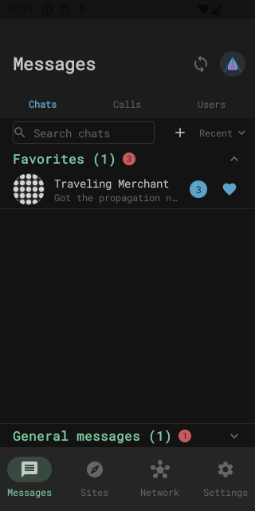
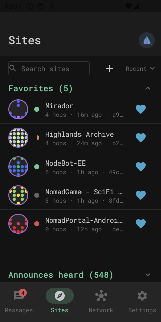
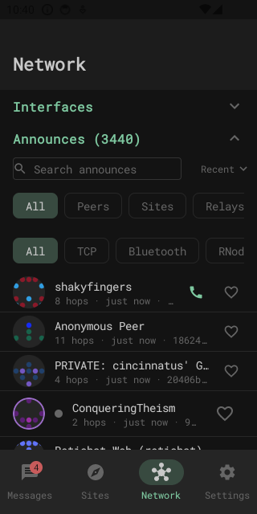
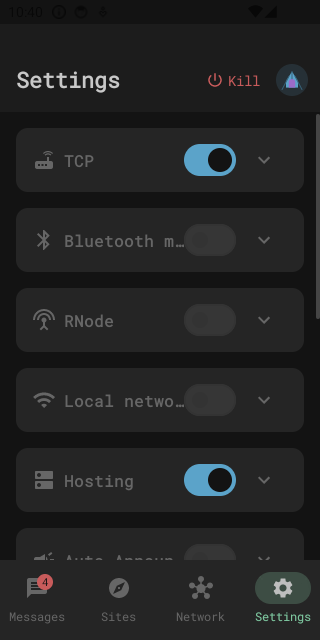

# NomadPortal-Android

A native Android app for messaging, calling, and browsing/hosting
[NomadNet](https://github.com/markqvist/NomadNet) pages over
[Reticulum](https://github.com/markqvist/Reticulum) — a mesh network that
needs no internet, no cell signal, no servers, and no accounts.[^1] An
independent, open-source project, and a from-scratch rewrite inspired by
[`jamesm92/nomadportal`](https://github.com/JamesM92/nomadportal) (the
author's existing Flask-based web portal for the same protocol stack), not a
port of its Flask/Jinja layer.

**Status: early beta.** Everything below is real and working on-device, not
aspirational — see [`nomadportal_android_handoff.md`](nomadportal_android_handoff.md)
for the full architecture and build sequencing.

## Screenshots

<table>
<tr>
<td></td>
<td></td>
<td></td>
<td></td>
</tr>
<tr>
<td align="center">Messages — unread badges</td>
<td align="center">Sites — fetch status</td>
<td align="center">Network — live announces</td>
<td align="center">Settings</td>
</tr>
</table>

## What You Can Do

- **Message without infrastructure** — LXMF messaging that works over
  whatever medium is available, with no server, account, or internet
  connection required.
- **Make voice calls** — real-time voice over Reticulum.
- **Browse, host, and edit NomadNet pages** — a full Micron page renderer
  and a dual-mode (rich-text or raw) on-device editor, so you can run your
  own site from your phone, not just view other people's.
- **Connect however you're reachable** — TCP, Bluetooth mesh, RNode (LoRa
  radio), and local Wi-Fi discovery, each independently toggleable.
- **Manage multiple identities on one device** — switch between them
  cleanly, each with its own isolated messages, contacts, and favorites.
- **Keep messages and calls private by default** — a contacts-only
  allowlist for each (separately), per-contact blocking, and disappearing
  messages. Location is never requested, period.
- **Wipe everything in an emergency** — a real panic-wipe gesture that
  securely erases identity, message, and contact data on-device.
- **Reach another device's shell remotely** — a built-in
  [`rnsh`](https://github.com/acehoss/rnsh) client for terminal access over
  Reticulum, no separate app required. See "Remote Shell (rnsh)" below.

## Getting Started

Download the latest APK from [Releases](../../releases/latest) and install
it on your Android device (you'll need to allow installs from this source,
since it isn't on the Play Store).

**This is currently a debug build, not a signed release** — there's no
release keystore set up yet, so Android will flag it as debuggable/
untrusted. That's expected and fine for an early beta; see the footnote
above for the fuller "vibe coded, no security audit" context before
relying on it for anything sensitive. No installable release exists yet
for anything other than Android.

## About Reticulum & NomadNet

[Reticulum](https://github.com/markqvist/Reticulum) is a networking stack
for building encrypted, resilient mesh networks over almost any medium —
LoRa radio, packet radio, Wi-Fi, TCP, even data-over-audio — designed for
low-bandwidth, high-latency links rather than assuming a fast always-on
internet connection underneath. [LXMF](https://github.com/markqvist/LXMF)
is the peer-to-peer message format this app sends messages with.
[NomadNet](https://github.com/markqvist/NomadNet) is the original desktop
client and page-hosting protocol this app is compatible with: Micron
(`.mu`) pages served directly off someone's own device, no web host
involved. This app lets you browse, host, and edit those pages from your
phone.

## Remote Shell (rnsh)

A client for [`rnsh`](https://github.com/acehoss/rnsh) — a real
terminal/shell session to another device, carried entirely over Reticulum
instead of SSH-over-IP. No separate app or extra network path needed: if a
peer is reachable over RNS at all (TCP, Bluetooth mesh, RNode, Wi-Fi), its
shell is reachable too, through the same mesh this app already speaks.

This is a client only — it connects to an existing `rnsh` listener (e.g. a
Raspberry Pi or any other machine running the real `rnsh` server), it
doesn't host one. Verified end-to-end against a live Raspberry Pi listener,
not just against a simulator. What's actually in the terminal:

- A real interactive PTY session with live resize as you rotate/resize the
  window, not a fixed-size text box.
- Per-session connection history, kept device-local — nothing about who
  you've shelled into leaves this device or gets sent over the link.
- A [BiometricPrompt](https://developer.android.com/reference/androidx/biometric/BiometricPrompt)
  device-credential gate before a saved session can be reopened, and an
  automatic session lock when the app is backgrounded or you navigate away
  — a remote root shell sitting unlocked in a backgrounded app is exactly
  the kind of thing a panic-wipe-capable app shouldn't allow.
- `FLAG_SECURE` on the terminal screen, so its contents can't be captured
  by screenshots, screen recording, or the recent-apps thumbnail.

## Roadmap

Areas actively being worked on, not yet finished:

- **Bluetooth mesh, broader verification.** The BLE mesh interface is real
  and toggleable today (RNS traffic over actual Bluetooth LE advertising,
  no internet or cell signal involved) and has been verified attaching and
  advertising on a real device. What's still ahead: verifying genuine
  multi-hop relay behavior across several real devices at once (so far
  confirmed single-device), and broader interoperability testing against
  other Reticulum-over-BLE implementations.
- **Guided RNode setup.** A built-in flow for flashing
  [RNode](https://unsigned.io/rnode/) firmware onto supported LoRa hardware
  directly from the app, plus a guided connection/pairing setup screen —
  closer to how [Columba](https://github.com/torlando-tech/columba) walks a
  user through RNode setup today — instead of requiring a separate desktop
  tool and manual configuration before an RNode interface can be used here.

## Architecture

Chaquopy-embedded Python backend (RNS/LXMF core logic) + native
Kotlin/Jetpack Compose UI. Compose was chosen specifically because its
declarative model handles mixed text-and-interactive-widget layouts
natively — this matters once Micron page-hosting with form fields is
involved. Full rationale in the handoff doc.

## Build

Requires:
- JDK 17
- Android SDK, compileSdk 37 (`minSdk` 31 — see "Toolchain versions" for why
  it's higher than Chaquopy's own floor)
- **Python 3.12 on the build machine** — Chaquopy resolves/installs `pip`
  dependencies (`rns`, `lxmf`) at build time, not just on-device. Chaquopy
  auto-detects it via `py -3.12` (Windows) / `python3.12` (Linux/Mac); if
  your Python 3.12 isn't registered under that standard command (e.g. a
  tool-managed install under a nonstandard `py` launcher tag), set
  `buildPython("C:/path/to/python.exe")` in `app/build.gradle.kts`
  locally — don't commit a machine-specific path there.

```sh
./gradlew assembleDebug
```

On Windows, use `gradlew.bat` instead of `./gradlew`.

## Toolchain versions

Pinned in [`gradle/libs.versions.toml`](gradle/libs.versions.toml):

| Component | Version | Notes |
|---|---|---|
| Android Gradle Plugin | 9.3.1 | |
| Gradle | 9.5.0 | matches Chaquopy's own tested combo |
| Kotlin | 2.4.10 | |
| Chaquopy | 17.0.0 | Python 3.10–3.14, min API 24 |
| Compose BOM | 2026.06.01 | |

`minSdk` is 31, higher than Chaquopy's own floor of 24 — Android's
`BLUETOOTH_SCAN` `neverForLocation` flag (required for this app's
"never request location, under any circumstances" policy) only exists on
API 31+.

These were cross-checked against Chaquopy's own live demo project
(`chaquo/chaquopy@master`, `demo/`) at scaffold time, since Chaquopy's
published compatibility table lags its actual latest-tested combo. `rns`
and `lxmf` (pinned in `app/build.gradle.kts`'s `chaquopy { pip { ... } }`
block) install cleanly for both target ABIs with prebuilt Android wheels
for `cryptography` (their one native dependency) — no source build
required, verified against a real build rather than assumed.

## License

[PolyForm Noncommercial 1.0.0](LICENSE) — free to use, modify, and
redistribute for any noncommercial purpose. Commercial use (including
repackaging into a paid product) requires a separate agreement with the
copyright holder. This is a deliberate departure from Sideband's CC
BY-NC-SA: same noncommercial spirit, but a license actually written for
software rather than creative works, with an explicit patent grant. See
[`nomadportal_android_handoff.md`](nomadportal_android_handoff.md#chaquopy--packaging-specifics)
for why this project isn't a fork of (and isn't bound by the license of)
Sideband itself.

## Security

See [`SECURITY.md`](SECURITY.md) for the threat model, vulnerability
reporting process, and what CI enforces on every PR (CodeQL, dependency
review, Gradle wrapper validation).

---

[^1]: **This project is "vibe coded"** — built in collaboration with an AI
    assistant. The author is not a security expert, and this code
    (including the parts that handle cryptographic identity, permissions,
    and untrusted network input) has not had a professional security
    audit. Treat it accordingly, especially before relying on it for
    anything sensitive. **Security-minded review, auditing, and
    improvements are genuinely welcome** — please open an issue or PR, or
    see [`SECURITY.md`](SECURITY.md) to report a vulnerability privately.
