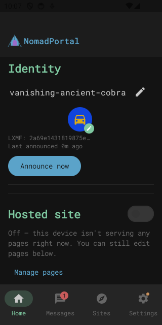
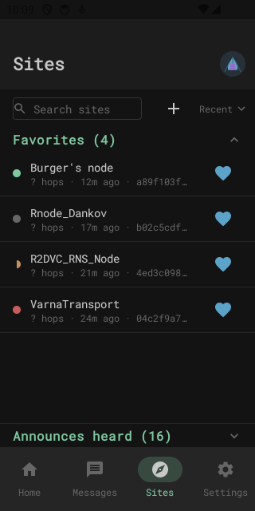
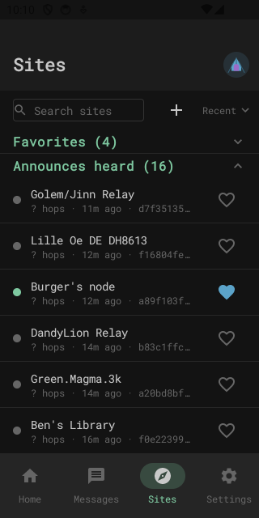
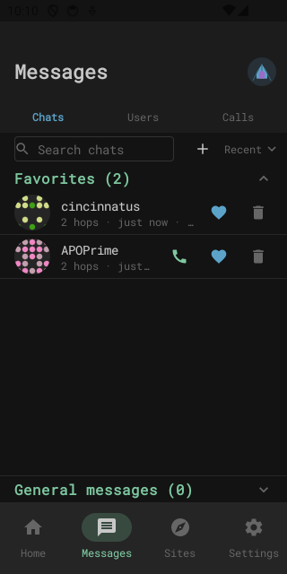
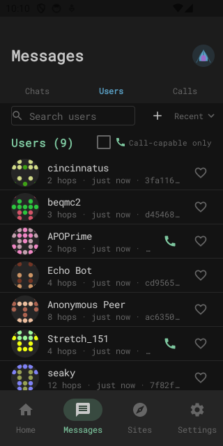

# NomadPortal-Android

> 🛑 **This project is not actively maintained.**
> [Columba](https://github.com/torlando-tech/columba) has significantly
> more community acceptance, polish, and maintainer resources behind it —
> if you're looking for a native Android client for Reticulum/NomadNet/
> LXMF, **use Columba instead.**

Two design choices from this project worth carrying forward:

- NomadNet sites are their own top-level **Sites tab**, a full sibling
  of Messages rather than folded into the contacts/chat list —
  browsing/hosted-page sites and LXMF messaging peers are two
  genuinely different kinds of thing on the network, and keeping them
  visually and structurally separate avoided conflating them.
- Each site carries a **last-fetch status indicator** right in the
  list, not just a bare address — visible at a glance without opening
  the page. Four real states, not just ok/fail: green (loaded last
  time), a half-filled amber dot (failed just now, but *has* worked
  before — a genuinely different signal from never having worked at
  all), solid red (never once loaded), and dim grey (never fetched
  yet).

| Bottom nav — Sites as a peer of Messages | Sites — Favorites, all 4 fetch-status states | Sites — Announces heard |
|---|---|---|
|  |  |  |

| Messages — Chats, with favorites and unread | Messages — Users heard on the mesh |
|---|---|
|  |  |

> ⚠️ **This project is "vibe coded"** — built in collaboration with an AI
> assistant. The author is not a security expert, and this code (including
> the parts that handle cryptographic identity, permissions, and untrusted
> network input) has not had a professional security audit. Treat it
> accordingly, especially before relying on it for anything sensitive.
> **Security-minded review, auditing, and improvements are genuinely
> welcome** — please open an issue or PR, or see
> [`SECURITY.md`](SECURITY.md) to report a vulnerability privately.

A native Android app for browsing, hosting, and editing
[NomadNet](https://github.com/markqvist/NomadNet) (Reticulum) pages — an
independent, open-source alternative to
[Sideband](https://github.com/markqvist/Sideband) with a broader feature
set. A from-scratch rewrite inspired by
[`jamesm92/nomadportal`](https://github.com/JamesM92/nomadportal) (the
author's existing Flask-based web portal for the same protocol stack), not a
port of its Flask/Jinja layer.

**Status: early scaffold.** Working Chaquopy-embedded Python interpreter
(with `rns`/`lxmf` installed and verified importing on-device — see
"Toolchain versions" below), a Settings screen with real connectivity/
hosting toggles and a panic-wipe gesture, but no browsing, hosting, or
editor functionality yet — those are blocked on `micron2compose` (a
separate sibling project) and the RNS/LXMF core extraction from
`nomadportal`. See
[`nomadportal_android_handoff.md`](nomadportal_android_handoff.md) for the
full architecture and build sequencing.

## Architecture

Chaquopy-embedded Python backend (RNS/LXMF core logic) + native
Kotlin/Jetpack Compose UI. Compose was chosen specifically because its
declarative model handles mixed text-and-interactive-widget layouts
natively — this matters once Micron page-hosting with form fields is
involved. Full rationale in the handoff doc.

## Build

Requires:
- JDK 17
- Android SDK, compileSdk 37 (`minSdk` 31 — see "Toolchain versions" for why
  it's higher than Chaquopy's own floor)
- **Python 3.12 on the build machine** — Chaquopy resolves/installs `pip`
  dependencies (`rns`, `lxmf`) at build time, not just on-device. Chaquopy
  auto-detects it via `py -3.12` (Windows) / `python3.12` (Linux/Mac); if
  your Python 3.12 isn't registered under that standard command (e.g. a
  tool-managed install under a nonstandard `py` launcher tag), set
  `buildPython("C:/path/to/python.exe")` in `app/build.gradle.kts`
  locally — don't commit a machine-specific path there.

```sh
./gradlew assembleDebug
```

On Windows, use `gradlew.bat` instead of `./gradlew`.

## Toolchain versions

Pinned in [`gradle/libs.versions.toml`](gradle/libs.versions.toml):

| Component | Version | Notes |
|---|---|---|
| Android Gradle Plugin | 9.3.1 | |
| Gradle | 9.5.0 | matches Chaquopy's own tested combo |
| Kotlin | 2.4.10 | |
| Chaquopy | 17.0.0 | Python 3.10–3.14, min API 24 |
| Compose BOM | 2026.06.01 | |

`minSdk` is 31, higher than Chaquopy's own floor of 24 — Android's
`BLUETOOTH_SCAN` `neverForLocation` flag (required for this app's
"never request location, under any circumstances" policy) only exists on
API 31+.

These were cross-checked against Chaquopy's own live demo project
(`chaquo/chaquopy@master`, `demo/`) at scaffold time, since Chaquopy's
published compatibility table lags its actual latest-tested combo. `rns`
and `lxmf` (pinned in `app/build.gradle.kts`'s `chaquopy { pip { ... } }`
block) install cleanly for both target ABIs with prebuilt Android wheels
for `cryptography` (their one native dependency) — no source build
required, verified against a real build rather than assumed.

## License

[PolyForm Noncommercial 1.0.0](LICENSE) — free to use, modify, and
redistribute for any noncommercial purpose. Commercial use (including
repackaging into a paid product) requires a separate agreement with the
copyright holder. This is a deliberate departure from Sideband's CC
BY-NC-SA: same noncommercial spirit, but a license actually written for
software rather than creative works, with an explicit patent grant. See
[`nomadportal_android_handoff.md`](nomadportal_android_handoff.md#chaquopy--packaging-specifics)
for why this project isn't a fork of (and isn't bound by the license of)
Sideband itself.

## Security

See [`SECURITY.md`](SECURITY.md) for the threat model, vulnerability
reporting process, and what CI enforces on every PR (CodeQL, dependency
review, Gradle wrapper validation).
